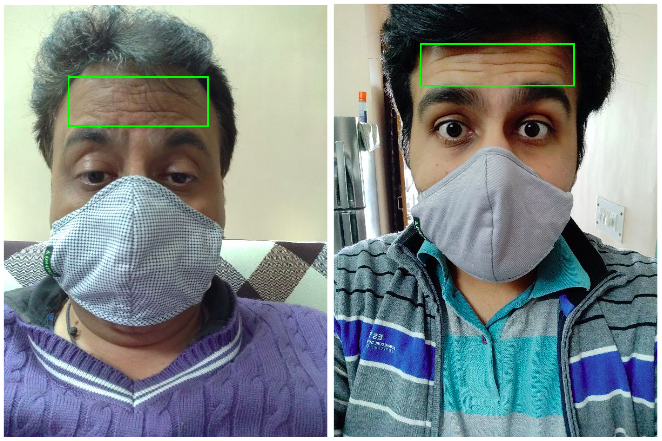

# Assignment Solutions | CS-672 (Advanced Deep Learning, Fall 2021), IIT Mandi
## Assignment 1
In this assignment, our task was to design a biometric system that takes the face (with masks) as input and compares it with an already existing image of the owner to predict whether to allow access or not. As the person is wearing the matching complete faces is difficult. Therefore, we match the **Forehead Wrinkles** to predict whether two images are same or not. Our pipeline consists of a forehand detection module and a matching module. For forehead detection, we finetune a pretrained Faster-RCNN model, and for forehead matching we finetune a pretrained ResNet 50 with ArcFaceLoss.
### Forehead Detection
<!-- {width:200px;} -->

